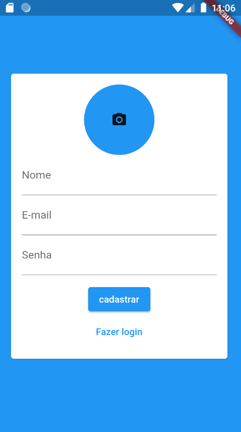
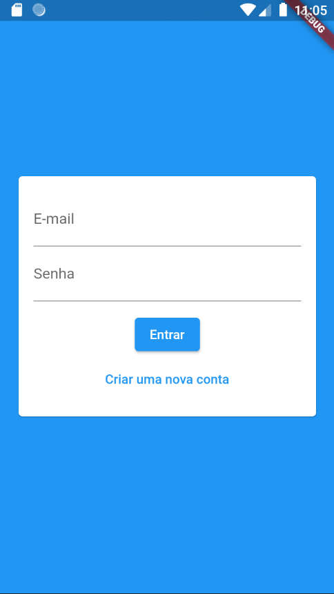
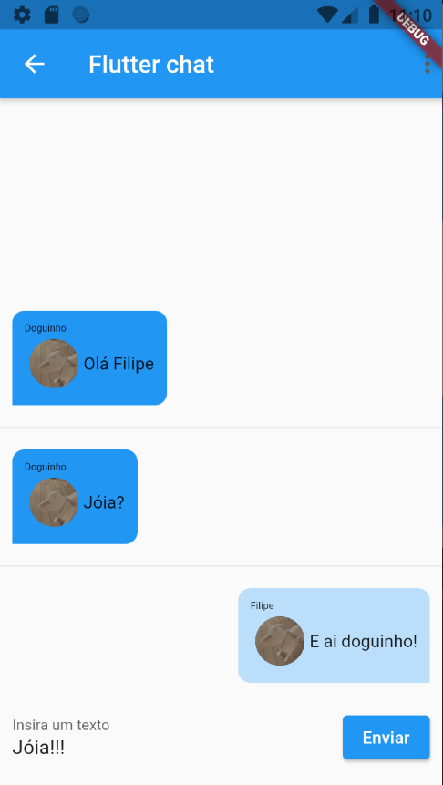

# chate_com_firebase

# Este é um projeto para experimentar recursos do google firebase:
    - firebase database(firestore)
    - firebase file bucket
    - firebase dynamic link
    - firebase auth

Como mostrado no gitignore do app android, não expus minha api_key por meio do arquivo 'google-services.json', então para rodar este App é necessário criar uma conta no google firebase e criar um aplicativo e lá terá um tutorial de como fazer a integração dos recursos do firebase e um aplicativo.

O App se trata de um chat para pessoas cadastradas, usando recurso do firebase.

# Fontes:
    - curso da cod3r com Leonardo Leitão
    - Documentação do google firebase

